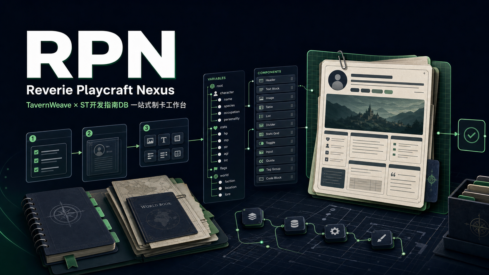

# Reverie Playcraft Nexus

**幻想、游玩与创作的交汇点。**

RPN 是面向玩家与制卡创作者的 Windows 桌面应用，将角色卡制作、内容审查、前端预览和创作辅助集中在一个工作台中。

## 核心功能

- 制卡指南：配合 TavernWeave 与 ST 开发指南，提供清晰的制作流程和新手指引。
- 制卡工作台：管理角色卡、世界书、正则、酒馆助手脚本、变量系统和前端组件。
- 内容审查：对照查看文字内容与代码结构，在导出前发现缺失、冲突和兼容性问题。
- 前端预览：预览独立页面、组件效果与 SillyTavern 挂载候选布局。
- Agent 对话管理：支持新建、切换、归档、总结续聊以及对话目录迁移。
- 创意工坊：浏览和管理社区组件与二创资源。

## 下载

[下载最新 Windows 桌面版](https://github.com/LiarMTTT/reverie-playcraft-nexus/releases/latest)

## 数据保护

工作区、对话历史和缓存保存在用户本机。更新、重装和默认卸载不会清理这些数据；任何清理操作都必须由用户主动选择。

## 反馈

发现问题或有功能建议，请前往 [GitHub Issues](https://github.com/LiarMTTT/reverie-playcraft-nexus/issues)。
